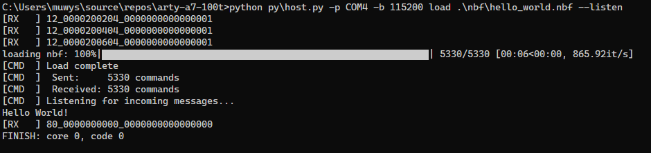

# BlackParrot on Arty A7 100T

This document describes how to create a design on the Arty A7 that instantiates a 64-bit RISC-V
[BlackParrot](https://github.com/black-parrot/black-parrot) processor core connected to the 256 MiB
on-board memory alongside a simple UART controller that can be used to control the BlackParrot
processor and read or write memory from a PC Host. The processor runs at 30 MHz.

We call this design ArtyParrot.

## Requirements

In addition to the requirements described in the [README](../README.md) for the memory-only design,
ArtyParrot requires `python 3.8` to execute the Host PC python script that communicates to the
on-board UART instantiated by the design.

## Setup

The BlackParrot processor code is included as a submodule located at `blackparrot/rtl` in this repository.
After checking out this module, run the following commands from the top-level directory to
fetch the required code:

```
git submodule update --init --checkout blackparrot/rtl
cd blackparrot/rtl
git submodule update --init --checkout --recursive external/basejump_stl
git submodule update --init --checkout --recursive external/HardFloat
```

To generate the project:
`vivado -mode batch -source tcl/arty-parrot.tcl`

To run synthesis, implementation, and generate bitsream:
`vivado -mode batch -source tcl/generate_bitstream.tcl --project_name arty-parrot`

## Hello World!

After compiling the bitstream for ArtyParrot, remove `JP2` on the Arty A7 board. This disconnects
a reset signal originating from the on-board UART chip that can cause spurious reset signals to be
sent to the BlackParrot processor.

Program the FPGA using the Vivado GUI and then the design is ready to be tested by running
the Hello, World! program on the processor. To do this, invoke the `host.py` script from the top
directory of this repository as follow:

`python py\host.py -p <serial port> load --listen .\nbf\hello_world.nbf`

You should see the following output:


## Software Development Kit (SDK)

The BlackParrot SDK allows you to compile additional programs to run on the processor. The SDK
includes basic functional tests (e.g., RISC-V tests) as well as more advanced programs like
those in BEEBS or even a complete Linux image. Note that loading large programs onto the Arty
over the UART interface can be slow.

To setup the BlackParrot SDK, first fetch the code as a submodule:

`git submodule update --init --checkout blackparrot/sdk`

Further instructions coming soon on how to setup the SDK and compile additional programs!
